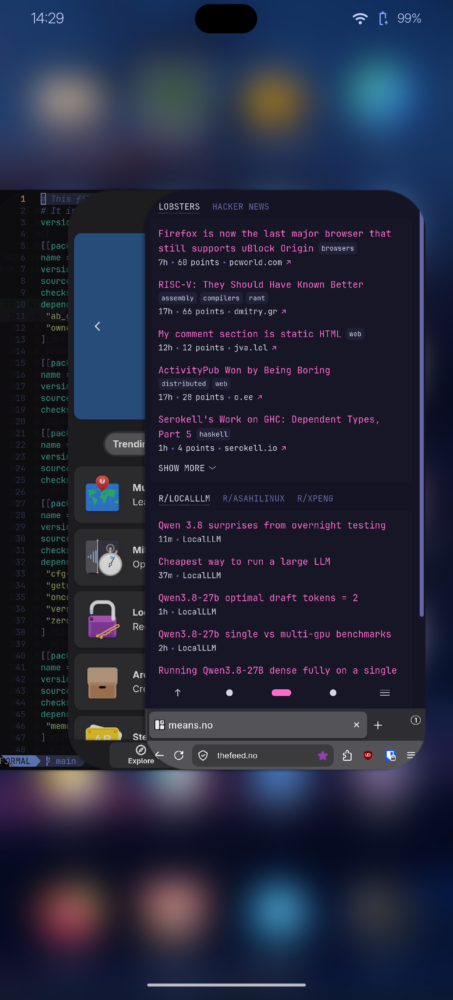
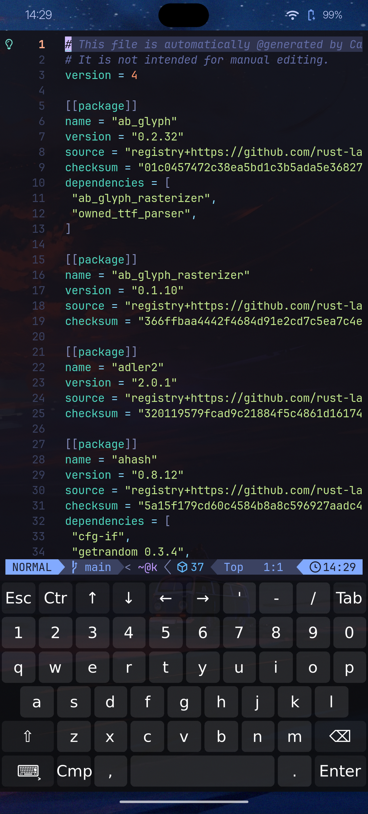
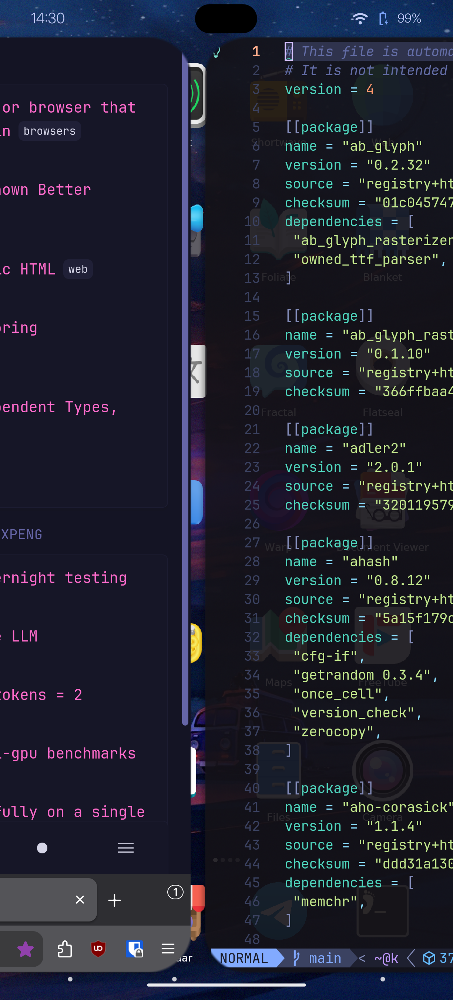

# Springchick

## A Wayland compositor for Linux phones, written in rust with Smithay and Skia

_IMPORTANT_: This project is made using LLM assist, however, it is not a low
effort project, and I don't consider it to be slop. It is in early development.
I'm daily driving it on my fairphone 5 running nixos. See
[dmsmobile](https://code.bas.es/marcus/dms-mobile) or
[my flake](https://code.bas.es/marcus/nix-config/src/branch/main/machines/dmsmobile/configuration.nix).

- Springchick gets a lot of inspiration from iOS' springboard shell, and will be
  quite familiar to iPhone users.
- Implements a single finger user interface with smooth animation and
  live updates of all cards across transitions.
- Home manager with paging and reordering/hiding.
- Pull down to search
- dbus based rotation in fullscreen apps like media players and games.
- Keyboard shortcuts with hardware key mapping including long press.
- Automatic keyboard pop up integration with wvkbd
- External display support (mirroring only)
- Supports most required wayland protocols including ones for screen
  recording/shots/clipboard++
- Currently mostly tested on Nixos, I recommend using the provided flake on
  nixos phones. I intend to provide a postmarketos repo soon.

## Screenshots

   

## On the roadmap

- Even smoother animations.
- More actions supported for hardware key mapping
- Startup apps on boot (currently best implemented through systemd user
  services)
- Optional rotation for UI in addition to the current full screen rotation.
